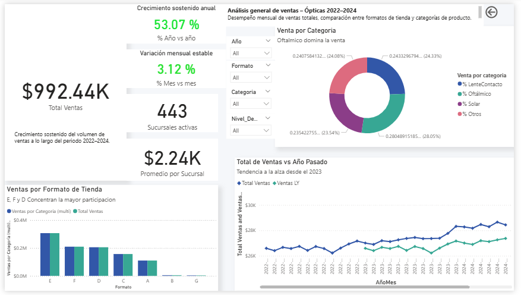
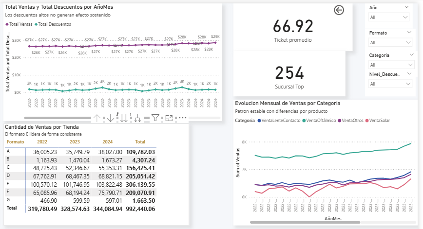
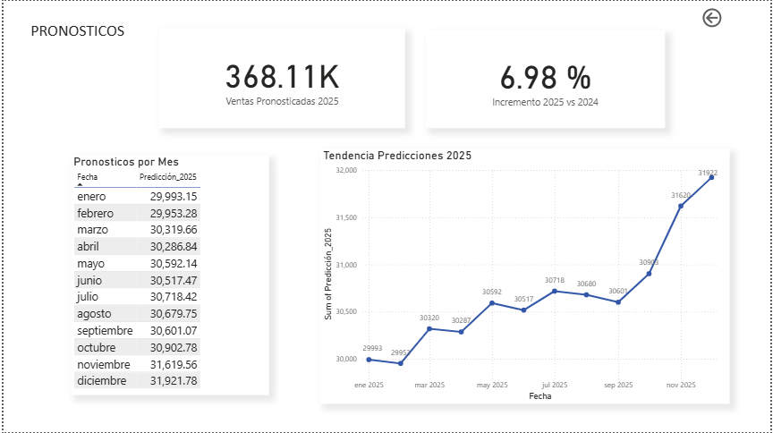

# 📊 Forecasting de Ventas en Retail Óptico (2025)

## 🧠 Contexto de negocio

En el sector retail, particularmente en cadenas de ópticas, la planificación de inventario depende directamente de la capacidad de anticipar la demanda.

Una mala estimación puede generar:

* Sobreinventario → costos innecesarios
* Quiebres de stock → pérdida de ventas
* Mala distribución entre sucursales

Este proyecto simula un escenario empresarial donde se busca predecir ventas futuras para optimizar la toma de decisiones comerciales.

---

## 🎯 Objetivo

Desarrollar un modelo de series de tiempo que permita:

* Predecir las ventas para el año 2025
* Identificar patrones de tendencia y estacionalidad
* Generar insights accionables para optimizar inventario

---

## 📂 Datos

* Tipo: Datos simulados de ventas retail
* Granularidad: Serie temporal
* Variables principales:

  * Fecha
  * Ventas

---

## ⚙️ Metodología

1. **Análisis exploratorio**

   * Identificación de tendencia y estacionalidad
   * Visualización de patrones temporales

2. **Preparación de datos**

   * Conversión a serie de tiempo
   * División en conjunto de entrenamiento y prueba

3. **Modelado**

   * Modelo utilizado: **Holt-Winters (Triple Exponential Smoothing)**
   * Componentes:

     * Nivel
     * Tendencia
     * Estacionalidad
   * Ajuste del modelo sobre datos históricos

4. **Evaluación**

   * MAE (Error Absoluto Medio)
   * RMSE (Raíz del Error Cuadrático Medio)
   * R² (Coeficiente de determinación)
  
## 📈 Resultados

El modelo Holt-Winters logró capturar tanto la tendencia como la estacionalidad de la serie de ventas.

- MAE: 231.77  
- RMSE: 332.84  
- R²: 0.68  

Esto indica que el modelo explica aproximadamente el 68% de la variabilidad en las ventas, siendo adecuado para escenarios de planeación en retail.

---

## 📉 Dashboard (Power BI)

Se desarrolló un dashboard para facilitar la toma de decisiones comerciales.

### Vista general
Muestra KPIs clave como ventas totales y crecimiento.


### Análisis de tendencias
Permite identificar patrones de comportamiento en el tiempo.


### Predicción vs real
Permite evaluar el desempeño del modelo.

---

## 💡 Hallazgos clave

1. Se identificó una **estacionalidad clara en la serie**, lo que valida el uso de Holt-Winters como modelo adecuado.

2. El modelo captura correctamente la tendencia general, aunque presenta desviaciones en periodos de alta volatilidad.

3. La combinación de tendencia + estacionalidad permite generar predicciones útiles para planeación de inventario a nivel agregado.

---
## 💼 Impacto de negocio

Este modelo permite:

- Reducir riesgo de sobreinventario
- Anticipar demanda futura
- Optimizar decisiones de compra
- Mejorar planeación comercial

---

## 🛠️ Tecnologías utilizadas

* Python (pandas, numpy, sklearn, statsmodels)
* Power BI
* Jupyter Notebook

---

## 📁 Estructura del repositorio

```
├── notebooks/
│   └── forecasting_ventas.ipynb
├── images/
│   ├── prediccion_vs_real.png
│   └── tendencia.png
├── dashboard/
│   └── ventas.pbix
└── README.md
```

---

## ⚠️ Limitaciones del modelo

* No incorpora variables externas (promociones, estacionalidad comercial, factores económicos)
* Sensible a cambios abruptos en la serie
* Desempeño limitado en picos extremos de demanda

---

## 📌 Conclusión

El uso de modelos de series de tiempo permite transformar datos históricos en herramientas de planeación estratégica.

Aunque el modelo presenta limitaciones, ofrece una base sólida para mejorar la toma de decisiones en inventario y ventas dentro del sector retail.

---

## 👤 Autor

Eduardo de la Torre
Data Analyst | Junior Data Scientist
[LinkedIn](https://www.linkedin.com/in/eduardo-de-la-torre-cientifico-de-datos)
